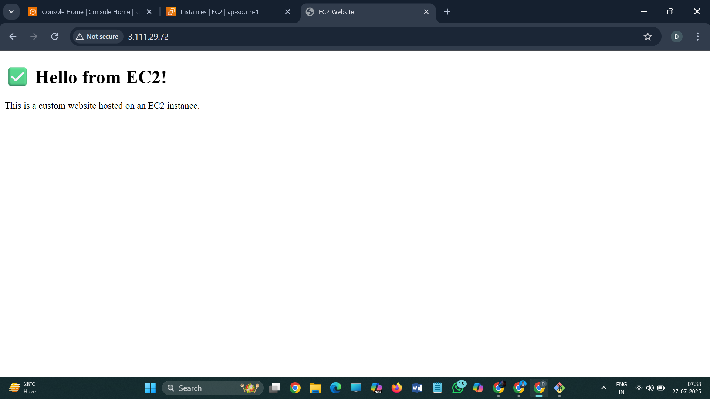

# ☁️ Hosting a Website on Amazon EC2

## 🔗 Live Website
Paste your EC2 Public IP here like this:  
http://3.111.29.72

---

## 🛠️ Technologies Used
- Amazon EC2
- Apache Web Server
- HTML

---

## 📷 Screenshot

---

## 💡 What I Learned
- Launching and connecting to an EC2 instance
- Installing Apache and hosting HTML pages
- Accessing a hosted site via EC2 public IP

---

## 🔜 Next Steps
- Hosting a site using Amazon Lightsail
- Domain mapping using Route 53
